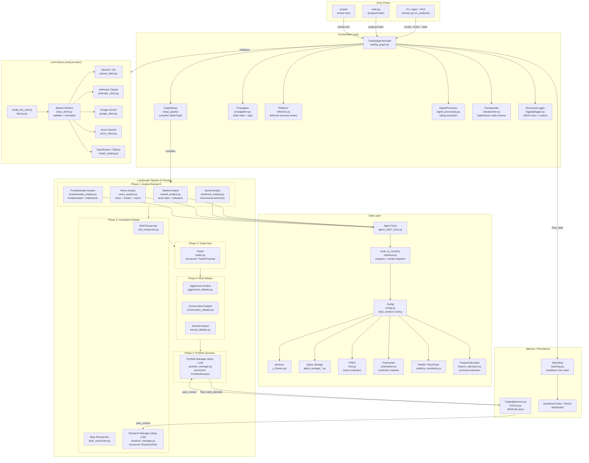

# TradingAgents Architecture

> Multi-Agent LLM Financial Trading Framework — 1713 symbols, 3649 relationships, 111 execution flows (per knowledge graph)

## Overview

TradingAgents is a **LangGraph-based multi-agent system** that chains 12+ specialized LLM agents through a structured trading analysis pipeline. A user supplies a ticker symbol and date; the framework orchestrates a **5-phase workflow** — analyst research, bull/bear debate, trade planning, risk analysis, and portfolio management — producing a final **Buy / Overweight / Hold / Underweight / Sell** decision backed by natural-language reasoning at every step.

The codebase is organized into six functional areas (detected via graph community detection):

| Area | Description |
|------|-------------|
| **Graph** (core) | Orchestrator — `TradingAgentsGraph`, `GraphSetup`, checkpointer, reflector, signal processor |
| **Agents** (core) | 4 analysts + 2 researchers + 2 managers + 1 trader + 3 risk debaters + utility tools |
| **LLM Clients** (core) | Multi-provider LLM abstraction (OpenAI, Anthropic, Google, Azure, OpenRouter, Ollama) |
| **Dataflows** (core) | Vendor-routed data layer with fallback chains (yfinance + Alpha Vantage + FRED + Polymarket) |
| **CLI** (entry) | Interactive terminal UI with model selection, live progress, and report saving |
| **Logging** (core) | Structured JSON logger with contextvars-based context enrichment |

## Architecture Diagram



## Agent Pipeline (Detailed)

Each phase is a LangGraph `StateGraph` node with conditional edges for debate looping.

### Phase 1: Analyst Research

Four analysts execute in **user-configured order** (default: market → social → news → fundamentals). Each analyst has a 3-node subgraph:
1. **Agent node** — LLM call with prompt + tool bindings → produces report
2. **Tool node** — Executes tool calls (data retrieval)
3. **Clear node** — Resets message list (required for Anthropic provider compatibility)

Conditional logic: if agent calls tools, route to ToolNode → back to agent; otherwise route to ClearNode → next analyst.

| Analyst | Tools | Report Key |
|---------|-------|------------|
| Market | `get_stock_data`, `get_indicators`, `get_verified_market_snapshot` | `market_report` |
| Social | `get_news` | `sentiment_report` |
| News | `get_news`, `get_global_news`, `get_insider_transactions`, `get_macro_indicators`, `get_prediction_markets` | `news_report` |
| Fundamentals | `get_fundamentals`, `get_balance_sheet`, `get_cashflow`, `get_income_statement` | `fundamentals_report` |

### Phase 2: Investment Debate (Bull vs Bear)

After all analysts complete, the debate loop begins:
1. **Bull Researcher** — argues for long position using analyst reports
2. **Conditional edge**: loop back to Bear if `should_continue_debate()` returns True
3. **Bear Researcher** — argues against using analyst reports
4. **Conditional edge**: loop back to Bull if `should_continue_debate()` returns True
5. **Research Manager** (deep-thinking LLM) — synthesizes debate into structured `ResearchPlan`

Max rounds controlled by `max_debate_rounds` config (default: 3).

### Phase 3: Trade Plan

**Trader** agent consumes the Research Manager's plan and produces `TraderProposal` with:
- `action` (Buy/Overweight/Hold/Underweight/Sell)
- `reasoning` (detailed prose)
- `entry_price`, `stop_loss`, `position_sizing`

### Phase 4: Risk Debate

Three risk viewpoints debate the Trader's proposal cyclically:
1. **Aggressive Analyst** — advocates maximum position
2. **Conservative Analyst** — advocates minimum risk
3. **Neutral Analyst** — advocates balanced approach

Loop controlled by `should_continue_risk_analysis()` with `max_risk_discuss_rounds` config (default: 2). Each analyst can route to the next or jump to Portfolio Manager when consensus forms.

### Phase 5: Portfolio Decision

**Portfolio Manager** (deep-thinking LLM) produces `PortfolioDecision`:
- `rating` (Buy/Overweight/Hold/Underweight/Sell)
- `executive_summary`
- `investment_thesis`
- `price_target`
- `time_horizon`

This is the **final output** of the pipeline.

## Key Execution Flows (from Knowledge Graph)

### 111 execution flows detected. Top flows by structural importance:

### Flow 1: Main Pipeline (`propagate → _run_graph`)

```
TradingAgentsGraph.propagate(ticker, date)
  ├── _resolve_pending_entries(ticker)     # resolve outcomes from prior runs
  │     ├── TradingMemoryLog.get_pending_entries()
  │     ├── _fetch_returns() → yfinance price history
  │     ├── Reflector.reflect_on_final_decision()
  │     └── TradingMemoryLog.batch_update_with_outcomes()
  ├── resolve_instrument_context(ticker)   # deterministic company identity lookup
  ├── [checkpointer setup if enabled]      # SqliteSaver for crash-resume
  └── _run_graph(ticker, date)
        ├── Propagator.create_initial_state()
        │     ├── past_context from TradingMemoryLog
        │     └── instrument_context from yfinance identity
        ├── graph.stream(state) or graph.invoke(state)
        │     └── (5-phase pipeline executes here)
        ├── _log_state() → JSON to disk
        ├── MemoryLog.store_decision()
        └── process_signal() → extract rating
```

### Flow 2: Tool Data Retrieval (`route_to_vendor`)

```
Agent tool call (e.g., get_fundamentals)
  → route_to_vendor("get_fundamentals", ticker, ...)
      └── get_category_for_method("get_fundamentals") → "fundamental_data"
      └── get_vendor("fundamental_data", "get_fundamentals")
            └── config["data_vendors"]["fundamental_data"]
      └── vendor chain iteration:
            ├── yfinance   → get_yfinance_fundamentals(ticker)
            └── alpha_vantage → get_alpha_vantage_fundamentals(ticker)
      └── Fallback logic:
            ├── VendorRateLimitError → try next vendor
            ├── VendorNotConfigured → try next vendor
            ├── NoMarketDataError → try next vendor
            └── Returns NO_DATA_AVAILABLE sentinel if all fail
```

### Flow 3: Checkpoint / Crash Recovery

```
TradingAgentsGraph.propagate()
  └── config["checkpoint_enabled"] = True
        └── get_checkpointer(data_cache_dir, ticker)
              └── SqliteSaver at .checkpoints/{ticker}/.db
        └── checkpoint_step(data_cache_dir, ticker, date)
              └── reads state.json → returns last completed step
        └── graph.compile(checkpointer=saver)
              └── inject thread_id = f"{ticker}_{date}"
        └── On success: clear_checkpoint(data_cache_dir, ticker, date)
              └── removes state.json + sqlite db
```

### Flow 4: Deferred Reflection (Phase B)

```
On next same-ticker run:
  TradingAgentsGraph._resolve_pending_entries(ticker)
    ├── TradingMemoryLog.get_pending_entries()
    │     └── reads trading_memory_log/{ticker}.json
    ├── For each pending entry:
    │     ├── _fetch_returns(ticker, date, holding_days=5)
    │     │     └── yfinance history → raw_return, alpha_return
    │     └── Reflector.reflect_on_final_decision()
    │           └── LLM generates 2-4 sentence "what worked / what didn't"
    └── TradingMemoryLog.batch_update_with_outcomes()
          └── atomic write to JSON file
```

### Flow 5: LLM Client Creation & Model Selection

```
TradingAgentsGraph.__init__()
  └── _get_provider_kwargs()
        ├── provider="openai"    → reasoning_effort
        ├── provider="anthropic" → effort
        ├── provider="google"    → thinking_level
        └── temperature (cross-provider)
  └── create_llm_client(provider, model, ...)
        └── factory.py:
              ├── openai    → OpenAIClient(model, api_key, base_url)
              ├── anthropic → AnthropicClient(model, ...)
              ├── google    → GoogleClient(model, ...)
              ├── azure     → NormalizedAzureChatOpenAI(model, ...)
              └── bedrock   → BedrockClient(model, ...)
        └── Each client.get_llm():
              ├── BaseLLMClient.warn_if_unknown_model()
              ├── with_structured_output (if supported)
              └── Returns LangChain-compatible chat model

CLI path (user interaction):
  └── select_shallow_thinking_agent() / select_deep_thinking_agent()
        ├── _select_model() → LLM-powered recommendation
        ├── _fetch_openrouter_models() → live catalog
        ├── provider_default_url() → endpoint config
        └── confirm_ollama_endpoint() → URL validation
```

## Functional Areas (from Knowledge Graph Clusters)

The codebase is organized into **94 communities** detected via Leiden community detection. Key clusters:

| Cluster | Label | Members | Cohesion | Top Nodes |
|---------|-------|---------|----------|-----------|
| 55 | **CLI** | 52 | 0.93 | `run_analysis`, `build_analyst_execution_plan`, `create_initial_state`, `_build_run_config`, `update_display` |
| 3 | **LLM Clients** | 76 | 0.98 | `get_llm`, `create_llm_client`, `OpenAIClient`, `warn_if_unknown_model` |
| 221 | **Memory/Tools** | 66 | 0.93 | `TradingMemoryLog`, `store_decision`, `load_entries`, `get_past_context` |
| 15 | **Model Selection** | 56 | 0.90 | `get_user_selections`, `select_openrouter_model`, `_select_model`, `provider_default_url` |
| 10 | **Signal/Rating** | 55 | 0.93 | `parse_rating`, `TraderProposal`, `create_portfolio_manager`, `process_signal` |
| 51 | **Symbol / Identity** | 46 | 0.85 | `normalize_symbol`, `resolve_instrument_identity`, `build_instrument_context` |
| 46 | **OHLCV Data** | 37 | 0.94 | `load_ohlcv`, `_clean_dataframe`, `_ensure_date_column`, `_assert_ohlcv_not_stale` |
| 35 | **Checkpoint / Reflection** | 32 | 0.88 | `build_verified_market_snapshot`, `reflect_on_final_decision`, `crash_and_resume` |
| 1 | **Structured Output** | 32 | 0.96 | `with_structured_output`, `_bound_kwargs`, `_input_to_messages` |

### Architectural Layers (per graph analysis)

| Layer | Modules | Description |
|-------|---------|-------------|
| **api** | `alphavantage` | External HTTP endpoints consumed (Alpha Vantage API, OpenRouter API) |
| **core** | `agents`, `dataflows`, `graph`, `llm_clients`, `logging`, `utils` | High fan-in, low fan-out — the stable foundation |
| **entry** | `cli/main.py`, `tests/` | Outbound-only callers; initiate workflows |
| **internal** | `scripts/generate_reports_json.py`, `scripts/smoke_structured_output.py` | Standalone utilities, no callers |

## Configuration System

```
tradingagents/default_config.py    ← default values (dict)
tradingagents/dataflows/config.py  ← runtime get/set/init with env override
    ├── set_config(dict)           ← push config at init
    ├── get_config()               ← read config anywhere
    └── initialize_config()        ← lazy-first-time setup
cli/main.py                        ← user selections overlay defaults
```

Key configuration keys:

| Key | Default | Purpose |
|-----|---------|---------|
| `llm_provider` | `"openai"` | Primary LLM backend |
| `deep_think_llm` | `"gpt-4o-mini"` | Model for Research Manager + Portfolio Manager |
| `quick_think_llm` | `"gpt-4o-mini"` | Model for analysts, researchers, debaters, trader |
| `backend_url` | `None` | Custom base URL (OpenRouter, Ollama) |
| `max_debate_rounds` | `3` | Max Bull↔Bear debate iterations |
| `max_risk_discuss_rounds` | `2` | Max Risk Analyst debate iterations |
| `data_vendors` | `{}` | Per-category vendor override |
| `tool_vendors` | `{}` | Per-tool vendor override |
| `output_language` | `"english"` | Language for agent responses (i18n support) |
| `checkpoint_enabled` | `False` | Enable SqliteSaver crash-resume |
| `temperature` | `None` | Cross-provider sampling temperature |

Environment variable support: `TRADINGAGENTS_*` prefix overrides any config key.

## LLM Client Providers

| Client | Provider | Structured Output | Provider-Specific Kwargs |
|--------|----------|-------------------|--------------------------|
| `openai_client.py` | OpenAI, xAI, OpenRouter | `with_structured_output` | `reasoning_effort` |
| `anthropic_client.py` | Anthropic Claude | `with_structured_output` | `effort` |
| `google_client.py` | Google Gemini | via bind_tools | `thinking_level` |
| `azure_client.py` | Azure OpenAI | `with_structured_output` | - |
| `bedrock_client.py` | AWS Bedrock | `with_structured_output` | - |

Client factory auto-detects provider from vendor subclasses. Fallback chain: explicit model match → provider prefix match → dynamic import. Custom endpoint support via `base_url` parameter and `*_BASE_URL` env vars.

## Structured Output Decision Chain

Three agents produce typed Pydantic output via `with_structured_output()`:

| Agent | Schema | Fields |
|-------|--------|--------|
| Research Manager | `ResearchPlan` | `recommendation`, `rationale`, `strategic_actions` |
| Trader | `TraderProposal` | `action`, `reasoning`, `entry_price`, `stop_loss`, `position_sizing` |
| Portfolio Manager | `PortfolioDecision` | `rating`, `executive_summary`, `investment_thesis`, `price_target`, `time_horizon` |

Fallback: `invoke_structured_or_freetext()` degrades gracefully to free-text when provider doesn't support native structured output. Applied per-provider in `_determine_mode()`.

## Data Layer

### Vendor Routing Architecture

```
Agent Tool Interface (tradingagents/agents/utils/*_tools.py)
        │
        ▼
   route_to_vendor(method, *args, **kwargs)
        │
        ├── get_category_for_method(method) → category
        ├── get_vendor(category, method)    → vendor chain from config
        │     ├── Per-tool override: config["tool_vendors"][method]
        │     └── Per-category fallback: config["data_vendors"][category]
        │
        └── Vendor chain iteration (configurable order):
              ├── try vendor[0]
              │     ├── VendorRateLimitError  → try next
              │     ├── VendorNotConfigured   → try next
              │     ├── NoMarketDataError     → try next
              │     └── success → return data
              ├── try vendor[1] ...
              └── all failed → return NO_DATA_AVAILABLE sentinel
```

### Vendor Categories & Sources

| Category | Methods | Vendors |
|----------|---------|---------|
| `core_stock_apis` | `get_stock_data` | yfinance, Alpha Vantage |
| `technical_indicators` | `get_indicators` | yfinance (stockstats), Alpha Vantage |
| `fundamental_data` | `get_fundamentals`, `get_balance_sheet`, `get_cashflow`, `get_income_statement` | yfinance, Alpha Vantage |
| `news_data` | `get_news`, `get_global_news`, `get_insider_transactions` | yfinance, Alpha Vantage |
| `macro_data` | `get_macro_indicators` | FRED API |
| `prediction_markets` | `get_prediction_markets` | Polymarket |

### Data Quality Features

- **OHLCV staleness guard** — `_assert_ohlcv_not_stale()` rejects data older than configurable threshold
- **Market data validation** — `build_verified_market_snapshot()` cross-references price points
- **Feature Calculator** — `FeatureCalculator.calculate_features()` computes derived indicators over 200+ day windows
- **Symbol normalization** — `normalize_symbol()` normalizes ticker formats; `resolve_instrument_identity()` provides deterministic company name lookup

## Memory & Persistence

### TradingMemoryLog

JSON file-based trading decision store at `{data_cache_dir}/trading_memory_log/{ticker}.json`.

| Method | Purpose |
|--------|---------|
| `store_decision(ticker, date, decision)` | Append decision for deferred reflection |
| `load_entries(ticker)` | Load all entries for a ticker |
| `get_pending_entries()` | Entries without outcome data |
| `get_past_context(ticker)` | Build context string from past reflections |
| `batch_update_with_outcomes(updates)` | Atomic write reflections + returns |

### Structured Logger

JSON Lines logger at `logs/` with contextvar-based enrichment:

```python
with LogContext(ticker="SPY", date="2026-05-10", agent="Market Analyst"):
    slog.info("Fetching price data")
# Produces: {"timestamp": "...", "level": "INFO", "message": "...", "ticker": "SPY", "date": "2026-05-10", "agent": "Market Analyst", "run_id": "..."}
```

Supports `slog.debug()`, `slog.info()`, `slog.warning()`, `slog.error()` with structured context.

## CLI (Interactive Terminal)

The CLI (`cli/main.py`) uses **typer** for commands and **rich** for live TUI:

1. **8-step interactive wizard** (`get_user_selections()`):
   - LLM provider selection (dropdown)
   - Quick-thinking model selection
   - Deep-thinking model selection
   - Ticker input + validation
   - Asset type detection (stock/crypto via suffix heuristics)
   - Date selection (preset ranges or custom)
   - Analyst selection (multi-select)
   - Review + confirm

2. **Live analysis display** (`run_analysis()`):
   - Real-time agent status indicators
   - Message log with timestamps
   - LLM/tool call stats (cost, latency counts)
   - Report sections building incrementally

3. **Post-analysis**:
   - Report save to disk (markdown tree)
   - Full report display on screen
   - Announcements fetch

## Agent Prompts

All prompts are defined inline in agent factory functions. Extracted to `tradingagents/agent_prompts.json` for configuration. Three styles used:

1. **ChatPromptTemplate + partial()** — 4 analyst agents (LangChain template with bound tools)
2. **Inline f-string** — 6 debate/research agents + 2 managers (interpolate state vars)
3. **Message list** — Trader + Reflector (list of `{role, content}` dicts)

Shared fragments: base analyst system message, language instruction, instrument context, markdown table suffix.

## Hotspots (High Fan-in Symbols)

The most-connected symbols in the graph (impact analysis critical):

| Symbol | Fan-in | File |
|--------|--------|------|
| `store_decision` | 32 | `agents/utils/memory.py` |
| `load_entries` | 30 | `agents/utils/memory.py` |
| `route_to_vendor` | 27 | `dataflows/interface.py` |
| `set_config` | 26 | `dataflows/config.py` |
| `get_llm` (BedrockClient) | 25 | `llm_clients/bedrock_client.py` |
| `get_capabilities` | 21 | `llm_clients/capabilities.py` |
| `get_instrument_context_from_state` | 17 | `agents/utils/agent_utils.py` |
| `invoke` (Azure) | 16 | `llm_clients/azure_client.py` |
| `get_language_instruction` | 15 | `agents/utils/agent_utils.py` |

## Directory Map

```
TradingAgents/
├── main.py                              # programmatic entry point example
├── cli/
│   ├── main.py                          # typer CLI app, 8-step wizard, Live display
│   ├── utils.py                         # model selection, ticker validation
│   ├── models.py                        # AnalystType enum
│   ├── config.py                        # CLI-specific config helpers
│   ├── stats_handler.py                 # LLM/tool call stats tracking
│   └── announcements.py                 # fetch + display announcements
├── tradingagents/
│   ├── __init__.py
│   ├── agent_prompts.json               # centralized prompt templates
│   ├── default_config.py                # default configuration dict
│   ├── reporting.py                     # markdown report tree writer
│   ├── agents/
│   │   ├── schemas.py                   # Pydantic models (ResearchPlan, TraderProposal, PortfolioDecision)
│   │   ├── analysts/
│   │   │   ├── market_analyst.py        # stock data + technical indicators
│   │   │   ├── sentiment_analyst.py     # social media/news sentiment
│   │   │   ├── news_analyst.py          # news + insider + macro + prediction markets
│   │   │   └── fundamentals_analyst.py  # fundamentals + financial statements
│   │   ├── researchers/
│   │   │   ├── bull_researcher.py       # bullish debate agent
│   │   │   └── bear_researcher.py       # bearish debate agent
│   │   ├── managers/
│   │   │   ├── research_manager.py      # debate synthesis (deep LLM)
│   │   │   └── portfolio_manager.py     # final decision (deep LLM)
│   │   ├── trader/
│   │   │   └── trader.py                # trade proposal agent
│   │   ├── risk_mgmt/
│   │   │   ├── aggressive_debator.py    # aggressive risk stance
│   │   │   ├── conservative_debator.py  # conservative risk stance
│   │   │   └── neutral_debator.py       # neutral risk stance
│   │   └── utils/
│   │       ├── agent_utils.py           # shared helpers (language instruction, instrument context)
│   │       ├── agent_states.py          # AgentState TypedDict
│   │       ├── core_stock_tools.py      # get_stock_data tool
│   │       ├── fundamental_data_tools.py # get_fundamentals, balance sheet, cashflow, income
│   │       ├── macro_data_tools.py      # get_macro_indicators tool
│   │       ├── market_data_validation_tools.py # verified market snapshot
│   │       ├── news_data_tools.py       # get_news, get_global_news, get_insider_transactions
│   │       ├── prediction_markets_tools.py # get_prediction_markets tool
│   │       ├── technical_indicators_tools.py # get_indicators tool
│   │       ├── memory.py                # TradingMemoryLog (JSON file store)
│   │       ├── rating.py                # parse_rating helper
│   │       ├── report_summarizer.py     # summarize_reports, _find_facts/risks/signal
│   │       └── structured.py            # invoke_structured_or_freetext fallback
│   ├── graph/
│   │   ├── trading_graph.py             # TradingAgentsGraph orchestrator
│   │   ├── setup.py                     # GraphSetup: compiles LangGraph StateGraph
│   │   ├── conditional_logic.py         # debate round limits, edge routing
│   │   ├── analyst_execution.py         # AnalystExecutionPlan builder
│   │   ├── reflection.py                # Reflector: deferred outcome reflection
│   │   ├── signal_processing.py         # SignalProcessor: parse rating from PM output
│   │   ├── propagation.py               # Propagator: initial state + graph args
│   │   └── checkpointer.py              # SqliteSaver checkpoint/resume
│   ├── llm_clients/
│   │   ├── __init__.py
│   │   ├── factory.py                   # create_llm_client() dispatcher
│   │   ├── base_client.py               # BaseLLMClient: validate, normalize
│   │   ├── openai_client.py             # OpenAI / xAI / OpenRouter
│   │   ├── anthropic_client.py          # Anthropic Claude
│   │   ├── google_client.py             # Google Gemini
│   │   ├── azure_client.py              # Azure OpenAI
│   │   ├── bedrock_client.py            # AWS Bedrock
│   │   ├── model_catalog.py             # known model lists per provider
│   │   ├── capabilities.py              # provider capabilities detection
│   │   ├── validators.py                # model validation helpers
│   │   └── api_key_env.py               # API key env var management
│   └── dataflows/
│       ├── __init__.py
│       ├── interface.py                 # route_to_vendor() vendor routing dispatcher
│       ├── config.py                    # runtime config get/set/init
│       ├── errors.py                    # NoMarketDataError, VendorNotConfiguredError, VendorRateLimitError
│       ├── utils.py                     # safe_ticker_component, path safety
│       ├── symbol_utils.py              # normalize_symbol, ticker normalization
│       ├── y_finance.py                 # yfinance data source (prices, fundamentals, statements)
│       ├── yfinance_news.py             # yfinance news source
│       ├── stockstats_utils.py          # technical indicators via stockstats (yf_retry, _calculate_*)
│       ├── feature_calculator.py        # FeatureCalculator (200+ day window analysis)
│       ├── market_data_validator.py     # market data validation logic
│       ├── alpha_vantage.py             # Alpha Vantage stock/fundamentals
│       ├── alpha_vantage_common.py      # shared AV helper functions
│       ├── alpha_vantage_fundamentals.py # AV fundamentals (cashflow, income, balance)
│       ├── alpha_vantage_indicator.py   # AV technical indicators
│       ├── alpha_vantage_news.py        # AV news + insider transactions
│       ├── alpha_vantage_stock.py       # AV stock price data
│       ├── fred.py                      # FRED macro data (CPI, interest rates, labor market)
│       ├── polymarket.py                # Polymarket prediction markets
│       ├── reddit.py                    # Reddit post fetcher (RSS)
│       └── stocktwits.py                # StockTwits social data
│   └── logging/
│       └── logger.py                    # StructuredLogger with contextvars
├── dashboard/                           # Vite + React dashboard
│   ├── index.html
│   ├── vite.config.js
│   └── src/
│       ├── main.jsx
│       ├── App.jsx
│       ├── dashboard/
│       │   ├── Overview.jsx
│       │   ├── AgentMonitor.jsx
│       │   ├── Analytics.jsx
│       │   ├── TradeHistory.jsx
│       │   ├── Reports.jsx
│       │   ├── LogConsole.jsx
│       │   └── Prompts.jsx
│       └── utils/mockData.js
├── tests/                               # pytest suite (60+ test files)
│   ├── conftest.py
│   ├── integration/                     # integration tests (Reddit, yfinance)
│   ├── test_analyst_execution.py
│   ├── test_checkpoint_resume.py
│   ├── test_memory_log.py
│   ├── test_signal_processing.py
│   ├── test_model_validation.py
│   ├── test_vendor_routing.py
│   ├── test_*                            # 45+ additional test files
│   └── ...
├── scripts/
│   ├── generate_reports_json.py          # report generation utility
│   └── smoke_structured_output.py        # structured output validation
├── pyproject.toml
├── requirements.txt
├── Dockerfile
├── docker-compose.yml
├── AGENTS.md                             # GitNexus + agent instructions
└── CLAUDE.md                             # project-level Claude instructions
```

## Technology Stack

| Layer | Technology |
|-------|-----------|
| Agent Framework | LangGraph (`StateGraph`, `ToolNode`, `SqliteSaver`) |
| LLM Providers | OpenAI, Anthropic Claude, Google Gemini, Azure OpenAI, AWS Bedrock, OpenRouter, Ollama |
| Prompt Templates | LangChain `ChatPromptTemplate` + custom f-strings |
| Structured Output | Pydantic v2 models + provider-native `with_structured_output()` |
| Data Vendors | yfinance (default), Alpha Vantage REST API, FRED, Polymarket |
| Financial Indicators | stockstats (pandas-based technical analysis) |
| Social Data | Reddit (RSS), StockTwits |
| CLI Framework | typer (commands) + rich (live TUI, markdown rendering) |
| Configuration | Python dict with env var overrides (`TRADINGAGENTS_*`) |
| Testing | pytest with markers: unit, integration, smoke |
| Containerization | Docker + docker-compose (with optional Ollama profile) |
| Memory | JSON file-based trading log with atomic batch writes |
| Checkpointing | LangGraph `SqliteSaver` for crash-resume |
| Logging | JSON Lines with contextvars-based structured context |
| Dashboard | Vite + React (development, mock-data based) |

## Architecture Decision Records

Key design decisions evident from the codebase:

1. **No external DB** — All state is file-based (JSON for memory log, SQLite for checkpoints). Simplifies deployment.
2. **Two LLM tiers** — `quick_thinking_llm` for throughput-sensitive agents (analysts, debaters), `deep_thinking_llm` for synthesis (Research Manager, Portfolio Manager).
3. **Vendor fallback chain** — Configurable ordered list; fails fast on core data, graceful degradation on optional categories.
4. **Deterministic instrument identity** — `resolve_instrument_identity()` anchors agents to real company data, preventing hallucination from price charts alone.
5. **Deferred reflection** — Outcome analysis happens on next same-ticker run, not inline. Prevents pipeline latency spikes.
6. **Anthropic compatibility** — Clear nodes between analysts reset message lists since Anthropic counts all messages toward context window.
7. **Structured output fallback** — `invoke_structured_or_freetext()` allows providers without `with_structured_output()` support to participate.

## Data Flow Summary

```
User Input (ticker, date, config)
  → TradingAgentsGraph.__init__()
    → create_llm_client() ×2 (quick + deep)
    → create tool nodes (4 categories)
    → GraphSetup.setup_graph() compiles StateGraph with 12+ nodes
  → propagate(ticker, date)
    → resolve pending outcomes (deferred reflection)
    → resolve instrument identity (deterministic company lookup)
    → [optional] compile with checkpointer
    → create initial AgentState (past context + instrument context)
    → graph.stream() through 5-phase pipeline:
        Phase 1 → 4 analysts (market, social, news, fundamentals)
          each: agent → tool loop → clear → next
        Phase 2 → Bull↔Bear debate → Research Manager synthesis
        Phase 3 → Trader proposal (structured)
        Phase 4 → Aggressive↔Conservative↔Neutral risk debate
        Phase 5 → Portfolio Manager final decision (structured)
    → log full state to JSON
    → store decision for future reflection
    → process_signal() extract rating
  → Return (final_state, rating)
```
